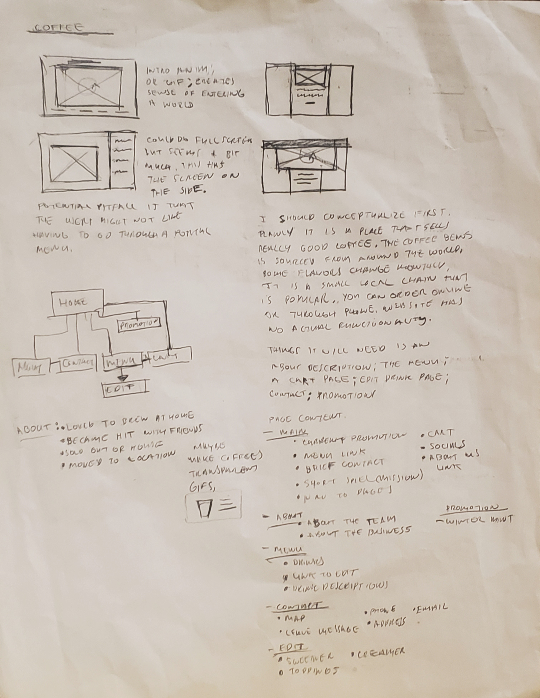
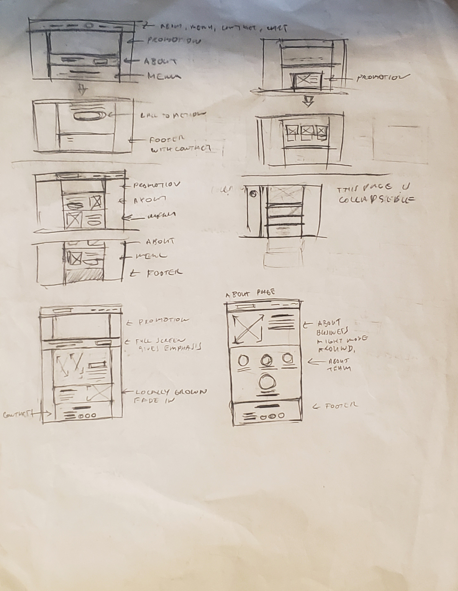
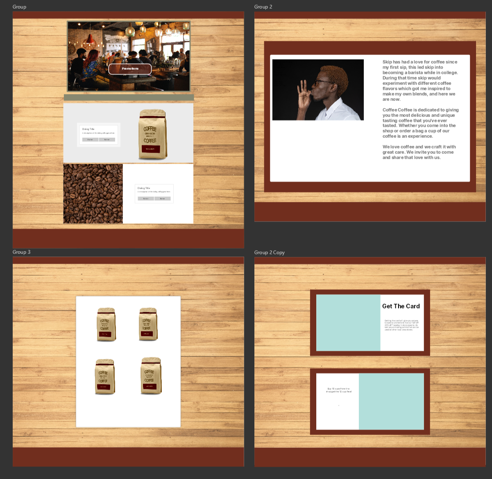

# Coffee Coffee website

### Introduction

The idea of this website came about as somewhat of a challenge. I wanted to develop a mock website design and was considering designing ideas that were interesting but also weren't tied to anything I was personally interested in, I feel this is reflective of most projects a developer will encounter. I'm personally not a coffee drinker though I know many who are, and while watching a few people congregate around a coffee maker the idea popped in my head to make a coffee website.

### Development 

Because I'm not into coffee myself I  needed to research different coffee shops and see what elements were needed to make a good coffee shop design, as well as general restaurants. Also I wanted to add limited functionality to it which included a cart and checkout page. 

I sketched out the initial layout and also ended up simultaneously designing the look in Lunacy (web UI design application) while I was coding it. The actual coffee bags were designed in photoshop while the logo was designed in inkscape. I was also able to have the items in the cart persist across all of the pages. The cart design and functionality ended up being not as difficult as I thought it would be. Part of it was built with a tutorial but I developed persistent functionality and the checkout functionality on my own. The challenge of my approach was keeping the design element cohesive due to the looser planning. 

 
 

### Outcome

The website has all the pages of a typical food/beverage restaurant with a cart that has functionality. Due to some of the challenges of this website, I understand where I can do tighter planning in the future in terms of layout (This can be demonstrated my portfolio).

## Built with 

    - html 
    - css
    - javascript